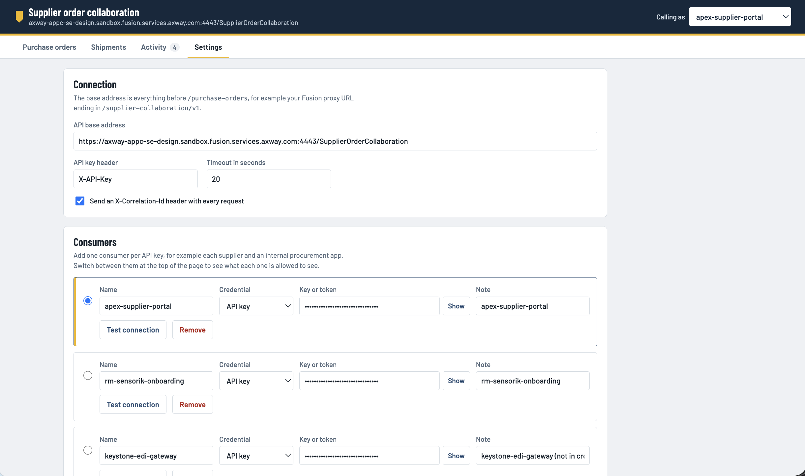
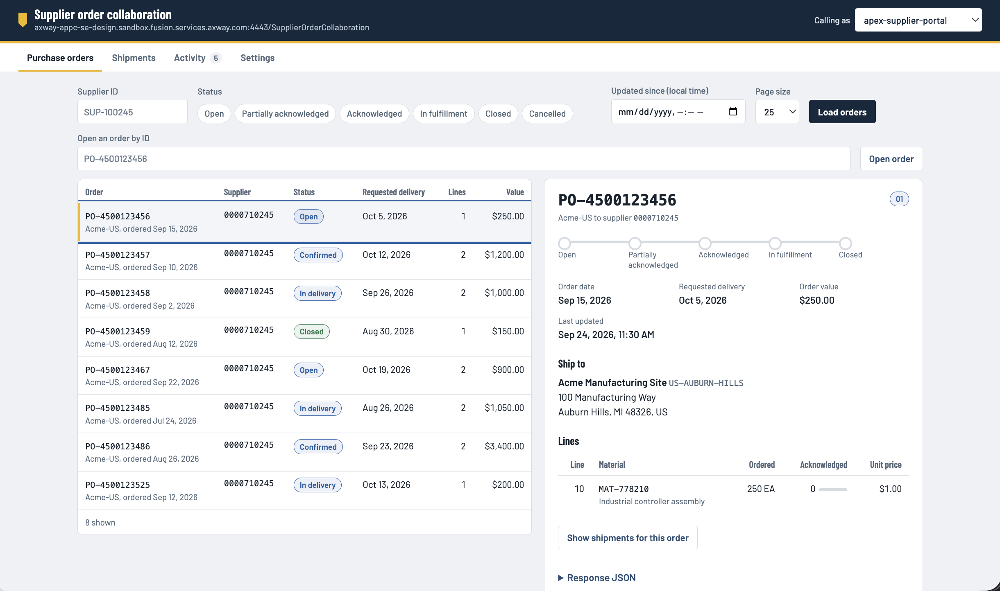
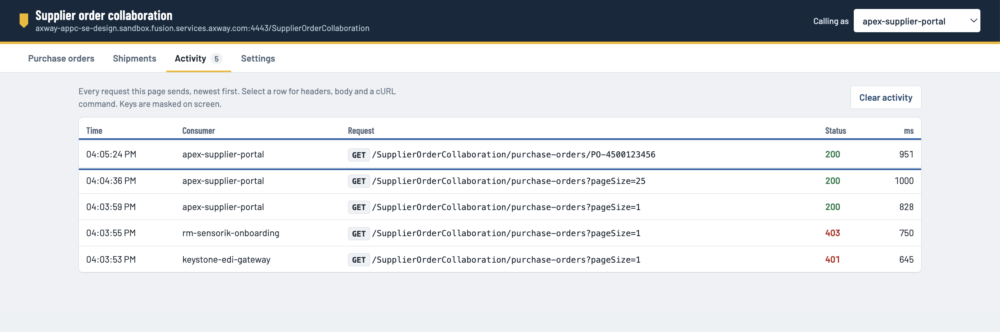
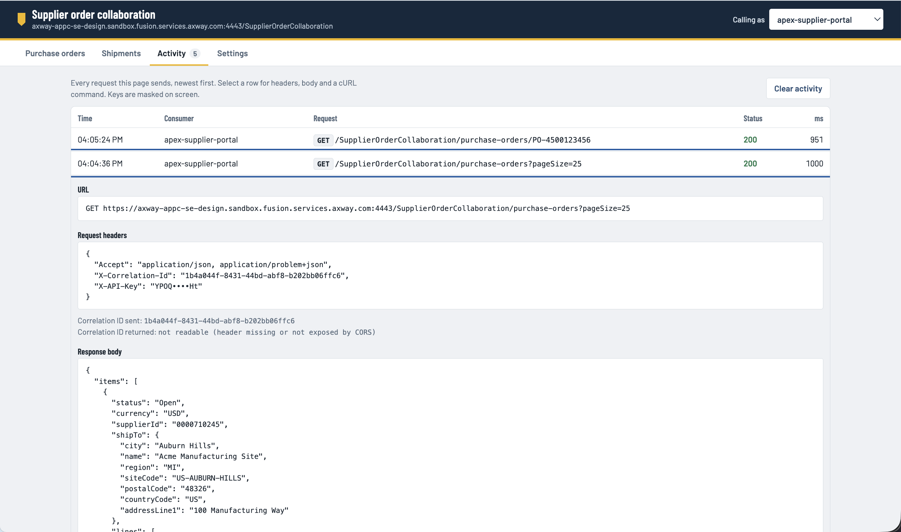
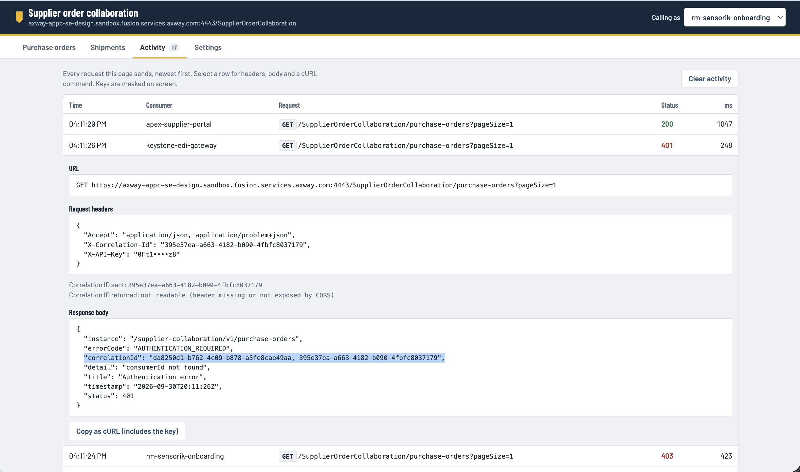

# Amplify Fusion - Supplier Order Collaboration API

An Amplify Fusion implementation of a Supplier Order Collaboration API defined by [this OpenAPI spec](Supplier_Order_Collaboration_OpenAPI_3_1.yaml).

Leverages the [Supplier Order Collaboration Mock backend](https://github.com/lbrenman/mock-purchase-order-backend).

An MCP Server for the backend systems is also included.

## Supported Features

* API Key authentication
  * Create a Fusion conusmer app per consumer (e.g. consumer id)
  * Create an entry in the `consumerIdLookup` cross reference table mapping the consumer app name (e.g. Apex-App) to the consumerId (e.g. apex-supplier-portal)
* A web app for front end API calls
* GET /purchase-orders
  * `supplierId` query param, pagination and some error handling not yet implemented
* GET /purchase-orders/{purchaseOrderId}
   * `supplierId` query param, pagination and some error handling not yet implemented

## Getting Started

* Import project file, `SupplierOrderCollaborationAPI.zip`, into Fusion
* Edit ERP, SRM and TMS Connections and point to the [Supplier Order Collaboration Mock backend](https://github.com/lbrenman/mock-purchase-order-backend) URL
* Create a Fusion consumer application with an api key for each consumer and enter into the `consumerIdLookup` cross reference table
* Activate the `SupplierOrderCollaborationAPI` API and get it's URL
* Activate the `webapp` Integration and get it's URL and past into a browser to launch the front end app
* Click on Settings and enter the SupplierOrderCollaborationAPI` API URL and create consumer with API Keys and click Save. Optionally export.
  
* Cick on Purchase Orders and select a consumer from the picker in the upper right corner and click the Load Orders button and click on a Purchase Order. You have just called the GET /purchase-orders and GET /purchase-orders/{puchaseOrderId} methods
  
* Click on the Activity tab to review the activity details
  
  
  